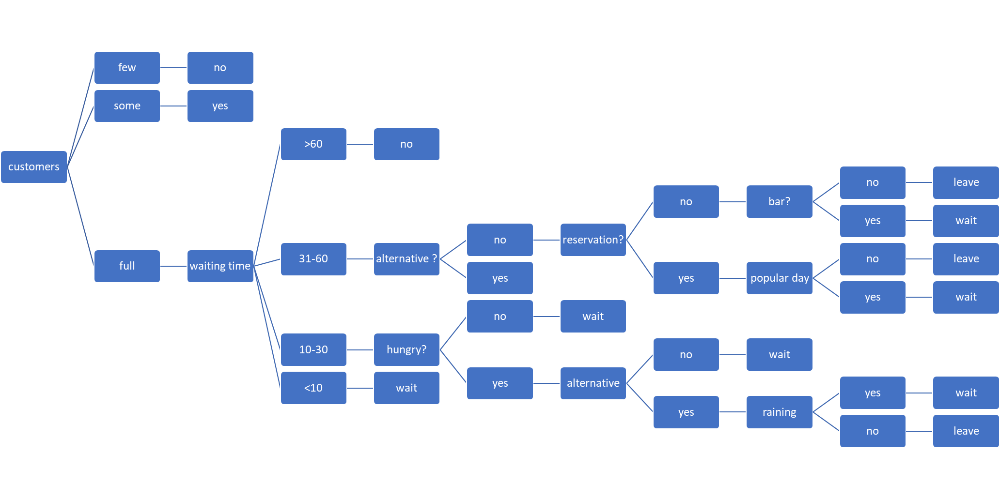

# IntelligentSystemsAssignment1
This repo is for my third year intelligent systems module 

ASSIGNMENT TITLE => WAIT FOR TABLE

|-----------------------|
|-- -- TO DO LIST -- -- |
|-----------------------|

--------------------------------
🖥️ Notes for the Code -- --
--------------------------------
-- -- Core Requirements -- --
- Implement the decision tree you’re allocated as a rule-based system, not nested if statements.
- System should:
    ->    Ask the user relevant questions.
    ->    Collect facts based on answers
    ->    Infer intermediate facts where needed.
    ->    Output a final decision with reasoning/explanation.
    ->    Dialogue must feel natural: avoid asking irrelevant questions after certain answers.

-- -- Implementation Tips -- --

- Knowledge Base (KB):
    ->    Store rules as IF conditions THEN conclusion.
    ->    Example: IF wings AND nocturnal THEN bat.
    ->    Represent rules in a dictionary/list of dictionaries or objects.

- Inference Engine:
    ->    Forward chaining (start from facts, apply rules until conclusion).
    ->    Or backward chaining (start from goal, ask user questions to prove/disprove).

- Dialogue Control:
    ->    Track which facts are known.
    ->    Skip questions once they’re no longer relevant.

- Usability
    ->    Questions should be clear, avoid jargon unless explained.
    ->    Provide traceable reasoning in output (e.g. “Because      it is nocturnal and has wings → Bat”).

-- -- Deliverables -- --

- Code Appendix in Report:
    ->    Text, clean formatting, comments explaining logic.
    ->    No screenshots.

- Video Demo:
    ->    Show system running through consultations.
    ->    Cover multiple paths in the decision tree.

-----------------------------------------
    📑 Notes for the Report
-----------------------------------------
-- -- Structure (suggested headings) -- --

- Introduction
    ->    Brief description of your problem domain (the tree you were assigned).
    ->    Purpose of expert systems and your chosen approach.

- System Description
    ->    How you converted the decision tree into rules.
    ->    How your knowledge base and inference engine work.
    ->    Example of rules (but don’t just paste the code — explain).

- Consultation Examples
    ->    Screenshots or transcripts of runs.
    ->    Show different outcomes.
    ->    Comment on how well it worked.

- Evaluation of System
    ->    Strengths (e.g. accurate outputs, tailored questions).
    ->    Weaknesses (e.g. limited scope, possible ambiguities).
    ->    Suggestions for improvements (e.g. adding more knowledge, handling uncertainty).

- AI Context
    ->    Rule-based systems in wider use (medical diagnosis, ticket pricing, etc.).
    ->    Ethical/commercial/social issues in your domain (e.g. misclassification consequences, user trust).
    ->    Human factors: explainability, usability, user interface.

- Knowledge Acquisition & Learning
    ->    Difficulties of acquiring rules from experts.
    ->    Inductive learning (e.g. decision tree learning from data) vs. manual rule creation.
    ->    Why uncertainty/complexity is challenging for rule-based systems.

- Conclusion
    ->    Summary of achievements.
    ->    Future work.
    ->    References
    ->    Academic and technical sources (properly formatted).

- Appendices
    ->    Full code (as text).
    ->    Link to Panopto demo.

    